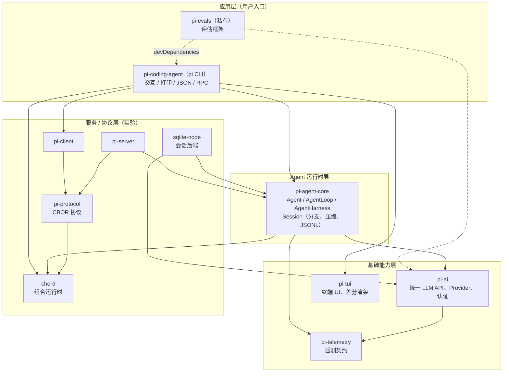
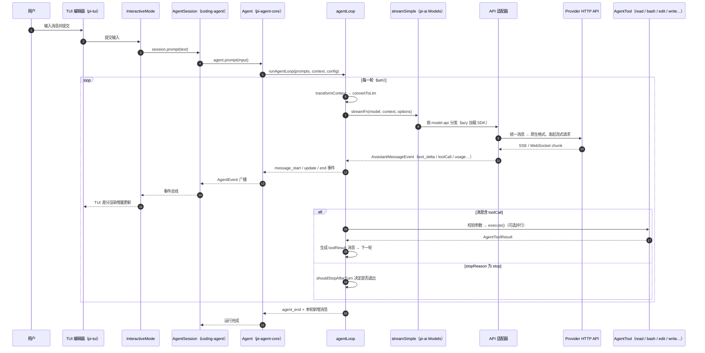

# 01 - 整体架构

> 返回 [Home](Home.md)

## 1. 分层架构总览

整个 monorepo 采用清晰的分层设计，依赖方向自上而下（上层依赖下层，反向禁止）：

```
┌─────────────────────────────────────────────────────────────────┐
│                    应用层（用户入口）                              │
│  pi-coding-agent（pi CLI）        pi-evals（评估框架）             │
│  交互模式 / 打印模式 / JSON / RPC 服务端                           │
├─────────────────────────────────────────────────────────────────┤
│                    Agent 运行时层                                 │
│  pi-agent-core                                                   │
│  Agent / AgentLoop / AgentHarness / Session(分支、压缩、JSONL)     │
├─────────────────────────────────────────────────────────────────┤
│           基础能力层                        │  服务/协议层（实验）   │
│  pi-ai（统一 LLM API、Provider、认证）  │  chord（组合运行时）     │
│  pi-tui（终端 UI、差分渲染）            │  pi-protocol（CBOR 协议）│
│  pi-telemetry（遥测契约）              │  pi-client / pi-server  │
│                                        │  sqlite-node（会话后端） │
└─────────────────────────────────────────────────────────────────┘
```

关键分层原则：

- **pi-agent-core 不直接依赖任何具体 Provider**：它通过 `StreamFn` 函数抽象调用 LLM，由上层（pi-coding-agent 的 SDK）注入 `pi-ai` 的 `streamSimple`（见 `packages/coding-agent/src/core/sdk.ts` 中 `setDefaultStreamFn(streamSimple)`）。

- **pi-tui、pi-ai、chord、pi-telemetry 相互独立**，可被无关项目单独使用。

- **RPC 协议栈（protocol/client/server）与 chord 组合**支撑实验性的"一个 Session、多个呈现端"架构（本地 server 进程 + TUI/WebUI 客户端）。

### 1.1 分层依赖图（Mermaid）



## 2. 核心数据流：一次用户提示的完整路径

以交互模式下用户输入一条消息为例：

```
用户输入 (TUI Editor)
   │
   ▼
InteractiveMode (coding-agent/src/modes/interactive/interactive-mode.ts)
   │  session.prompt(text)
   ▼
AgentSession (coding-agent/src/core/agent-session.ts)        ← 应用层会话封装
   │  内部持有 pi-agent-core 的 Agent/Harness
   ▼
Agent (agent/src/agent.ts)                                    ← 有状态 Agent 封装
   │  runAgentLoop / runAgentLoopContinue
   ▼
agentLoop (agent/src/agent-loop.ts)                           ← 低层循环
   │  每轮：convertToLlm → transformContext → streamFn() → 工具执行
   ▼
streamSimple (ai/src/models.ts, Provider.streamSimple)        ← LLM 调用入口
   │  按 model.api 分发到具体 API 适配器（lazy 加载）
   ▼
API 适配器 (ai/src/api/*.ts, 如 anthropic-messages / openai-responses)
   │  统一消息 → Provider 原生格式；SSE → AssistantMessageEventStream
   ▼
Provider HTTP API (Anthropic / OpenAI / Google / Bedrock / ...)
   │  流式响应事件回流
   ▼
AssistantMessageEventStream → AgentEvent 事件流逐层向上广播
   │  toolCall → AgentTool.execute()（read/bash/edit/write/grep/find/ls…）
   ▼
TUI 组件树响应事件增量渲染（chat-viewport、assistant-message、tool-execution）
```

### 2.1 一次提示的完整时序图



几个关键抽象在数据流中的位置：

| 抽象                            | 定义位置                                 | 职责                                                              |
| ----------------------------- | ------------------------------------ | --------------------------------------------------------------- |
| `AgentMessage`                | `agent/src/types.ts`                 | LLM 消息 + 应用自定义消息的联合类型，全链路统一使用                                   |
| `StreamFn`                    | `agent/src/types.ts`                 | LLM 调用的函数抽象（`Models.streamSimple` 满足此签名）                        |
| `AgentEvent`                  | `agent/src/types.ts`                 | Agent 生命周期事件（`agent_start/turn_end/message_*/tool_execution_*`） |
| `HarnessEvent`                | `agent/src/harness/agent-harness.ts` | Harness 层事件（含 lane、compaction、navigation、retry）                 |
| `AssistantMessageEventStream` | `ai/src/utils/event-stream.ts`       | Provider 流式响应的统一事件流                                             |

## 3. 运行模式

`pi` CLI 根据参数与 TTY 状态分为四种运行模式（见 `packages/coding-agent/src/main.ts` 的 `resolveAppMode`）：

| 模式              | 触发条件                    | 入口                                      | 用途                                       |
| --------------- | ----------------------- | --------------------------------------- | ---------------------------------------- |
| **interactive** | 默认（stdin/stdout 均为 TTY） | `modes/interactive/interactive-mode.ts` | 全屏 TUI 交互                                |
| **print**       | `--print/-p` 或非 TTY 管道  | `modes/print-mode.ts`                   | 一次性执行并输出文本                               |
| **json**        | `--mode json`           | `modes/json-event.ts`                   | 输出 JSON 事件流（供脚本消费）                       |
| **rpc**         | `--mode rpc`            | `modes/rpc/rpc-mode.ts`                 | stdin/stdout 上的 JSON-RPC 服务端（SDK/IDE 集成） |

另有实验性子命令（需开启 experimental 特性）：`pi experimental server`（启动本地 Unix socket 服务进程）与 `pi experimental client`（连接服务进程的 TUI/CLI 客户端）。

## 4. 仓库目录结构

```
pi-mono/
├── package.json                 # npm workspaces 根配置
├── AGENTS.md                    # 项目开发规则（人类与 Agent 共用）
├── CONTRIBUTING.md              # 贡献指南
├── biome.json                   # Biome lint/格式化配置
├── test.sh / pi-test.sh / mini-test.sh
├── scripts/                     # 根级脚本（发布、模型目录、检查等）
├── .pi/                         # 仓库自用配置：prompts、skills、extensions
├── .github/workflows/           # CI：构建、发布、npm audit
└── packages/
    ├── ai/                      # 统一 LLM API（src/api、src/providers、src/auth…）
    ├── agent/                   # Agent 运行时（src/agent.ts、src/harness/…）
    ├── tui/                     # 终端 UI 库（src/components、src/tui.ts…）
    ├── coding-agent/            # pi CLI（src/cli、src/core、src/modes、src/experimental…）
    ├── chord/                   # 应用组合运行时（独立于 Pi）
    ├── protocol/                # RPC 协议（CBOR、framing、信封）
    ├── client/                  # RPC 客户端
    ├── server/                  # RPC 服务器
    ├── telemetry/               # 遥测契约
    ├── session-backends/
    │   └── sqlite-node/         # SQLite 会话后端
    └── evals/                   # 评估框架
```

每个包内部约定基本一致：`src/` 源码、`test/` 测试（vitest 或 node:test）、`package.json`、`tsconfig.build.json`、`README.md`、`CHANGELOG.md`。

## 5. 跨切面设计决策

### 5.1 TypeScript 约束

- 全仓库使用 ESM（`"type": "module"`），Node >= 22.19。

- 根配置检查的代码（`packages/*/src`、`packages/*/test`）只允许**可擦除的 TypeScript 语法**（Node strip-only 模式）：禁止 `enum`、`namespace`、参数属性、`import =` 等需要 JS emit 的构造。

- 类型检查使用 `tsgo`（TypeScript native preview）`--noEmit`。

- Schema 校验统一使用 `typebox`（`Type`、`Static`、`TSchema`）。

### 5.2 类型安全的事件流

pi-ai 定义了统一的流式协议：所有 Provider 的流式响应都被转换为 `AssistantMessageEvent`（`text_delta`、`thinking_delta`、`toolCall`、`usage` 等帧），错误不抛异常而是在流内以 `stopReason: "error" | "aborted"` 结束。该契约向上贯穿 agent loop 与 harness。

### 5.3 会话持久化（JSONL）

会话以 JSONL 条目（Entry）日志形式持久化，支持树状分支（branch/lane）、fork、压缩（compaction）摘要条目。存储接口 `Storage` / `SessionRepo` 抽象了内存、JSONL、SQLite 等后端（见 [03-pi-agent-core](03-package-agent.md)）。

### 5.4 实验性多进程架构（chord + protocol）

`packages/coding-agent/src/experimental/` 内含新一代架构的雏形：一个可替换的 server 进程持有 Session 与 AgentHarness，通过 chord services 向多个呈现端（TUI、WebUI）广播复制状态；`pi-protocol` 负责 CBOR 编码与 Unix socket 传输。该部分标记为 experimental，无兼容性保证。

## 6. 各包职责一句话总结

- **pi-ai**：把 30+ 家 LLM Provider 统一成一套消息类型与流式 API，附带模型目录生成、认证（API key + OAuth）与凭据存储。

- **pi-agent-core**：不绑定任何 Provider 的 Agent 循环 + 有状态 Agent + 持久化 Harness（lane/分支/压缩/重试）。

- **pi-tui**：组件化终端 UI，差分渲染、布局系统、编辑器、鼠标支持。

- **pi-coding-agent**：把上述能力组装成 `pi` CLI —— 参数解析、设置/资源加载、内置工具、扩展系统、三种运行模式、SDK。

- **chord**：面向插件化应用的组合运行时（facet 拆分、service 依赖图、复制状态、插件打包加载）。

- **protocol/client/server**：实验性 RPC 协议栈。

- **telemetry**：厂商中立 span 契约 + 类型化 schema。

- **sqlite-node**：Session 存储的 SQLite 后端实现。

- **evals**：把真实 AgentSession 适配到 vitest-evals 的行为评估框架。

