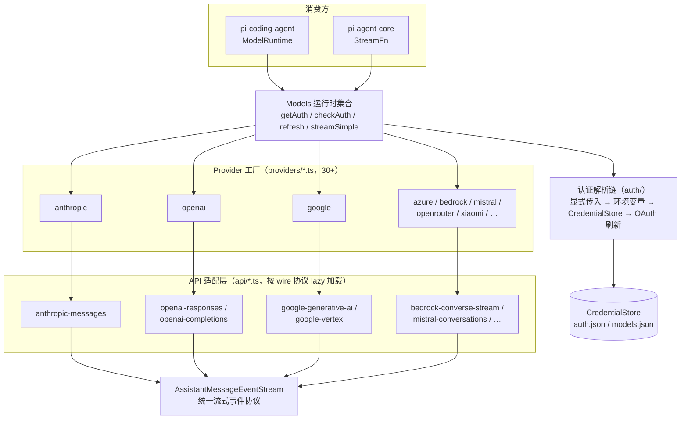
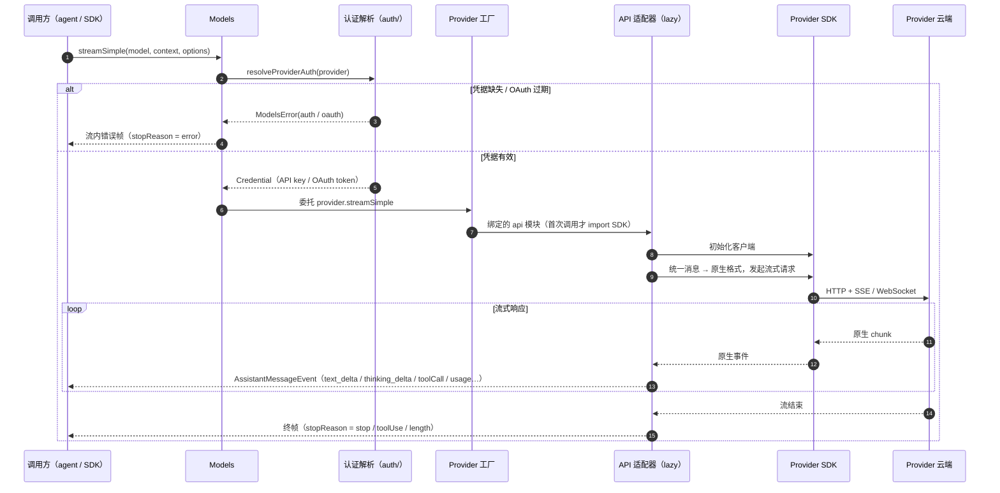

# 02 - pi-ai 包：统一多 Provider LLM API

> 返回 [Home](Home.md) | 包路径：`packages/ai`

## 1. 职责定位

`@earendil-works/pi-ai` 提供统一的 LLM API：一套消息类型、一套流式事件协议、一套 Provider 抽象，覆盖 30+ Provider（Anthropic、OpenAI、Google、AWS Bedrock、Azure、Mistral、OpenRouter、Groq、Fireworks、Together、DeepSeek、小米、Qwen Token Plan 等）。附带自动模型目录生成（从 models.dev 与各 Provider 目录抓取）、认证体系（API key + OAuth + 环境变量）与凭据存储。

设计要点（见 `src/index.ts` 顶部注释）：**根入口无副作用**，只导出核心类型与无状态工具；Provider 工厂位于 `@earendil-works/pi-ai/providers/*` 子路径，API 实现位于 `@earendil-works/pi-ai/api/*`，旧全局 API 位于 `/compat`。

## 2. 目录结构

```
packages/ai/src/
├── types.ts                 # 核心类型：消息、模型、Provider、请求/流选项
├── models.ts                # Provider / Models 接口与运行时集合
├── models.generated.ts      # 生成的模型目录（勿手改）
├── model-catalog.ts         # 模型目录序列化/校验
├── models-store.ts          # 本地 models.json 持久化
├── oauth.ts                 # OAuth 流程入口
├── env-api-keys.ts          # 环境变量 → API key 映射
├── images.ts / images-models.ts / image-models.generated.ts / images-api-registry.ts
│                            # 图像生成 API（OpenRouter 等）
├── compat.ts                # 兼容层：全局 stream/complete 便捷函数
├── session-resources.ts     # 会话资源（cache affinity 等）
├── cli.ts                   # `pi-ai` 命令行（调试/列模型）
├── api/                     # API 适配层（每种 wire 协议一个模块）
│   ├── anthropic-messages.ts / anthropic-messages.lazy.ts
│   ├── openai-responses.ts / openai-completions.ts / openai-responses-shared.ts
│   ├── openai-codex-responses.ts / azure-openai-responses.ts
│   ├── google-generative-ai.ts / google-vertex.ts / google-shared.ts
│   ├── bedrock-converse-stream.ts
│   ├── mistral-conversations.ts
│   ├── pi-messages.ts       # 纯 pi 消息 API（测试/本地）
│   ├── cloudflare.ts / cloudflare-ai-binding.ts
│   ├── transform-messages.ts # 跨 API 消息转换
│   └── lazy.ts              # lazyApi() 懒加载包装器
├── providers/               # Provider 工厂与模型表（<name>.ts + <name>.models.ts）
│   ├── all.ts               # builtinProviders() / builtinModels() 注册表
│   ├── faux.ts              # 测试用假 Provider
│   └── …（30+ Provider 文件对）
├── auth/                    # 认证：context、credential-store、resolve、helpers
└── utils/                   # event-stream、retry、overflow、estimate、validation 等
```

## 3. 核心类型体系（`src/types.ts`）

### 3.1 消息类型（与 Provider 无关的统一格式）

| 类型 | 说明 |
|------|------|
| `UserMessage` | `{ role: "user", content: string \| (TextContent \| ImageContent)[], timestamp }` |
| `AssistantMessage` | `{ role: "assistant", content: (TextContent \| ThinkingContent \| ToolCall)[], api, provider, model, usage, stopReason, errorMessage?, deferred?, … }` |
| `ToolResultMessage` | `{ role: "toolResult", toolCallId, toolName, content: (TextContent \| ImageContent)[], details? }` |
| `Message` | 上述三种的联合 |

内容块（content block）类型：

- `TextContent`：`{ type: "text", text, textSignature? }`
- `ThinkingContent`：`{ type: "thinking", thinking, thinkingSignature?, redacted? }`（推理内容，signature 用于多轮回放）
- `ImageContent`：`{ type: "image", data(base64), mimeType }`
- `ToolCall`：`{ type: "toolCall", id, name, arguments, thoughtSignature?, namespace? }`

关键字段：

- `StopReason = "pending" | "stop" | "length" | "toolUse" | "error" | "aborted" | "deferred"`
- `Usage`：`{ input, output, cacheRead, cacheWrite, reasoning?, totalTokens, cost{…} }` —— 统一计费/统计口径
- `DeferredHandle`：异步（deferred）响应的持久句柄，支持 15m/1h/24h 窗口

### 3.2 API 与 Provider 标识

```ts
type KnownApi =
  | "openai-completions" | "openai-responses" | "openai-codex-responses"
  | "azure-openai-responses" | "anthropic-messages" | "google-generative-ai"
  | "google-vertex" | "bedrock-converse-stream" | "mistral-conversations"
  | "pi-messages" | (string & {});   // 可扩展
```

每个 API 对应 `src/api/` 下一个模块，导出统一的 `ProviderStreams` 形状：

```ts
interface ProviderStreams {
  stream(model, context, options?): AssistantMessageEventStream;
  streamSimple(model, context, options?): AssistantMessageEventStream;
  fetchDeferred?(model, handle, options?): AssistantMessageEventStream;
  cancelDeferred?(model, handle, options?): Promise<void>;
}
```

### 3.3 请求选项

- `ProviderRequestOptions`：`signal`、`telemetryContext`、`apiKey`、`fetch`、`env`、`onPayload`/`onResponse` 钩子、`headers`、`timeoutMs`、`maxRetries`、`maxRetryDelayMs`
- `StreamOptions`：追加 `temperature`、`maxTokens`、`samplingParams`（透传给 llama.cpp/vLLM 等自定义参数）、`transport`（sse/websocket/auto）、`cacheRetention`、`sessionId`、`metadata`
- `SimpleStreamOptions`：追加 `reasoning`（`ThinkingLevel`）、`toolChoice`、`deferred`、`thinkingBudgets`

### 3.4 Model 类型

`Model<TApi>` 描述单个模型：`id`、`name`、`api`、`provider`、`baseUrl`、`reasoning`、`input`（支持的输入类型）、`cost`（每百万 token 价格）、`contextWindow`、`maxTokens`、`thinkingLevels`、`samplingParams` 等。模型目录由 `scripts/generate-models.ts` 从外部数据源生成到 `models.generated.ts`（**禁止手改**，更新需走脚本再生成）。

## 4. Provider 抽象（`src/models.ts`）

### 4.1 `Provider<TApi>` 接口

```ts
interface Provider<TApi extends Api = Api> {
  readonly id: string;            // 如 "anthropic"
  readonly name: string;
  readonly baseUrl?: string;
  readonly auth: ProviderAuth;    // apiKey / oauth 认证声明
  getModels(): readonly Model<TApi>[];          // 静态目录或上次刷新结果
  refreshModels?(context): Promise<void>;       // 动态 Provider 拉取最新模型表
  filterModels?(models, credential): readonly Model<TApi>[];
  stream<T extends TApi>(model, context, options?): AssistantMessageEventStream;
  streamSimple(model, context, options?): AssistantMessageEventStream;
  fetchDeferred?(…); cancelDeferred?(…);
}
```

Provider 工厂文件模式（以 `src/providers/anthropic.ts` 为例）：声明 `auth`（API key 环境变量 + OAuth 选项）、`baseUrl`、`api` 绑定（指向 `api/anthropic-messages.ts` 的 `lazyApi` 包装）、并注入 `anthropic.models.ts` 中的静态模型表。`src/providers/all.ts` 汇总所有内置 Provider，导出 `builtinProviders()` 与 `builtinModels()`。

### 4.2 `Models` 接口（运行时集合）

`Models` 是 Provider 的运行时集合，负责认证解析与请求分发：

- `getProviders()` / `getProvider(id)` / `getModels(provider?)` / `getModel(provider, id)`
- `refresh(options)`：并发刷新动态 Provider 的模型表
- `checkAuth(providerId)` / `getAvailable(providerId?)`：认证检查与可用模型过滤
- `getAuth(providerId | model, overrides?)`：解析认证（API key / OAuth token），失败以 `ModelsError`（code `oauth`/`auth`）拒绝
- `login(providerId, type, interaction)` / `logout(…)`：执行 OAuth 登录流并持久化凭据
- `stream(model, context, options?)` / `streamSimple(...)`：解析认证后委托给所属 Provider

`agent` 包的 `StreamFn` 抽象正是由 `Models.streamSimple` 满足。

### 4.3 架构图（Mermaid）



## 5. API 适配层（`src/api/`）

每个模块负责一种 wire 协议：

1. **消息转换**：统一 `Message[]` → Provider 原生格式（如 Anthropic messages、OpenAI responses input、Google content parts）。
2. **流式转换**：SSE/WebSocket chunk → `AssistantMessageEvent`（`text_delta` / `thinking_delta` / `toolCall` / `usage` / `stopReason`），封装为 `AssistantMessageEventStream`。
3. **特性映射**：thinking level 映射（如 Google 的 `thinkingBudget`、OpenAI 的 `reasoning.effort`）、cache control、工具 schema 转换、错误体解析。

**懒加载机制**：每个 API 模块有配套 `<name>.lazy.ts`，通过 `lazy.ts` 的 `lazyApi()` 在首次调用时才 `import()` 真实 SDK（如 `@anthropic-ai/sdk`、`openai`、`@google/genai`），保证根入口加载轻量（有 `lazy-module-load.test.ts` 保障）。

跨 API 消息转换（如 Copilot 的 OpenAI 格式 → Anthropic 格式）由 `api/transform-messages.ts` 处理。

### 5.1 streamSimple 调用时序图



## 6. 认证体系（`src/auth/` + `src/oauth.ts`）

- **CredentialStore**（`auth/credential-store.ts`）：凭据持久化接口（JSON 文件），存储 API key 与 OAuth token（含刷新）。
- **AuthContext**（`auth/context.ts`）：认证上下文（当前有效凭据、交互回调）。
- **resolve.ts**：认证解析链 —— 显式传入 → 环境变量（`env-api-keys.ts` 定义每个 Provider 的 env 名）→ credential store → OAuth 刷新。
- **oauth.ts**：统一 OAuth 流程（authorization code + PKCE、device code），供多个 Provider（Anthropic、OpenRouter、xAI、Kimi、Codex 等）复用；`bun-oauth.ts` 为 Bun 运行时变体。

## 7. 关键函数速查

| 函数/类 | 位置 | 说明 |
|---------|------|------|
| `streamSimple(model, context, options)` | `compat.ts` | 最常用的单次流式调用入口（全局便捷函数） |
| `completeSimple(...)` | `compat.ts` | 非流式便捷封装（聚合流结果） |
| `EventStream` / `AssistantMessageEventStream` | `utils/event-stream.ts` | push/end 语义的异步事件流原语 |
| `validateToolArguments` | `utils/validation.ts` | 基于 typebox schema 校验工具参数（agent loop 使用） |
| `estimateTokens` / `estimateContextTokens` | `utils/estimate.ts` | 上下文 token 估算（压缩决策使用） |
| `builtinProviders()` | `providers/all.ts` | 全部内置 Provider 实例 |
| `clampThinkingLevel` | `utils/` | 将请求的 thinking level 钳制到模型支持范围 |
| `uuidv7` | `utils/uuid.ts` | 时间有序 UUID（会话/条目 ID 生成） |

## 8. 依赖

- **外部**：`openai`、`@anthropic-ai/sdk`、`@google/genai`、`@aws-sdk/client-bedrock-runtime`、`@smithy/node-http-handler`、`http(s)-proxy-agent`、`partial-json`、`typebox`。
- **内部**：仅 `@earendil-works/pi-telemetry`（请求选项中透传 `telemetryContext`）。

## 9. 模型数据管线

```
scripts/model-data.ts（外部数据源抓取/缓存）
  → scripts/generate-models.ts --strict
    → src/models.generated.ts（提交进仓库的静态目录）
  → scripts/generate-models.ts --json-only --json-output .artifacts/model-catalog
    → 模型目录 JSON（发布到 pi.dev，供客户端远程刷新）
```

根级命令：`npm run generate:models`、`npm run hydrate:model-data`、`npm run check:model-data`、`npm run generate:model-catalog`。
