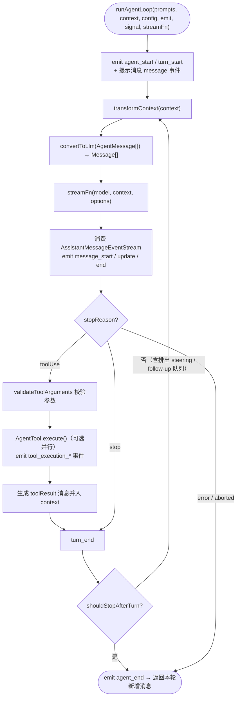
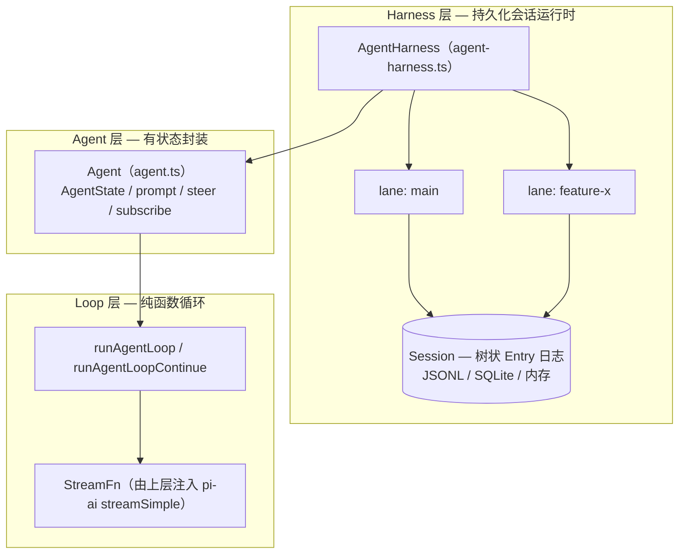
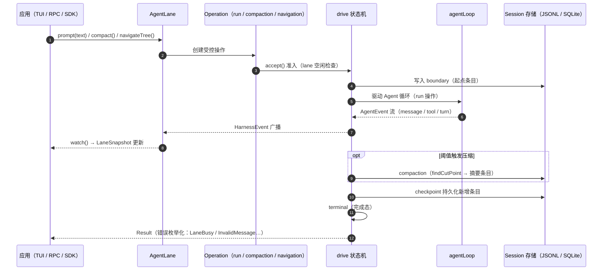

# 03 - pi-agent-core 包：Agent 运行时

> 返回 [Home](Home.md) | 包路径：`packages/agent`

## 1. 职责定位

`@earendil-works/pi-agent-core` 是与 Provider 无关的通用 Agent 运行时，包含三层能力：

1. **低层 Agent Loop**（`src/agent-loop.ts`）：纯函数式的 LLM 调用-工具执行循环；
2. **有状态 Agent**（`src/agent.ts`）：封装 transcript、生命周期事件、steering/follow-up 队列；
3. **AgentHarness**（`src/harness/`）：持久化会话运行时 —— lane（分支）、树状导航、上下文压缩、重试、事件与钩子系统。

## 2. 目录结构

```
packages/agent/src/
├── index.ts              # 导出入口（含 harness/session/tools 全部公共 API）
├── types.ts              # Agent 层核心类型（StreamFn、AgentEvent、AgentTool…）
├── agent.ts              # Agent 类（有状态封装）
├── agent-loop.ts         # runAgentLoop / runAgentLoopContinue 低层循环
├── stream-fn.ts          # 默认 StreamFn 的 set/get（由上层注入 pi-ai）
├── proxy.ts              # 代理相关
├── node.ts               # Node 专用入口
├── search/               # 会话搜索
└── harness/
    ├── agent-harness.ts      # AgentHarness 接口 + createAgentHarness 门面
    ├── types.ts              # AgentHarnessTool / Resources / 执行环境类型
    ├── context.ts            # Harness Context（chord 风格取消/值上下文）
    ├── config.ts / events.ts / hooks.ts / messages.ts
    ├── result.ts             # Result<T, E> 错误类型体系
    ├── skills.ts             # Skill 资源
    ├── prompt-templates.ts   # 提示模板资源
    ├── system-prompt.ts      # 系统提示构建
    ├── telemetry.ts          # pi.ai.* / pi.harness.* / pi.session.* span schema
    ├── compaction/           # 上下文压缩 + 分支摘要
    ├── env/nodejs.ts         # Node 执行环境（Shell/FileSystem 绑定）
    ├── execution/            # assistant 执行原语、effect gate、工具执行
    ├── runtime/              # harness.ts（createAgentHarness 实现）、drive（运行驱动状态机）、
    │                         #   lane.ts、reducer.ts（快照归并）、restore.ts、transcript.ts
    ├── session/              # Session 持久化：session.ts、jsonl/（编码/存储/仓库）、
    │                         #   memory.ts（内存后端）、fork.ts、mutation-line.ts、values.ts
    ├── tools/                # 内置可移植工具：bash、edit、write、read、image 等
    └── utils/                # adaptive-publisher、output-capture、shell-output、truncate、usage
```

## 3. 核心类型（`src/types.ts`）

### 3.1 `StreamFn`

```ts
type StreamFn = (
  model: Model<Api>,
  context: Context,
  options?: SimpleStreamOptions,
) => AssistantMessageEventStream | Promise<AssistantMessageEventStream>;
```

LLM 调用的唯一出口。契约：**不得抛异常**；失败必须编码在返回流中（最终 `AssistantMessage` 带 `stopReason: "error" | "aborted"` 与 `errorMessage`）。`Models.streamSimple` 满足此签名；上层通过 `setDefaultStreamFn()` 注入默认实现。

### 3.2 `AgentMessage` 与自定义消息扩展

```ts
type AgentMessage = Message | CustomAgentMessages[keyof CustomAgentMessages];
```

应用通过 declaration merging 向 `CustomAgentMessages` 注入自定义消息类型（如 pi-coding-agent 的 `custom`、`notification` 消息），在 `convertToLlm` 时过滤或转换。

### 3.3 `AgentTool`

```ts
interface AgentTool<TParameters extends TSchema, TDetails> extends Tool<TParameters> {
  label: string;                      // UI 显示名
  prepareArguments?(args: unknown);   // 旧格式参数兼容 shim
  execute(toolCallId, params, signal?, onUpdate?): Promise<AgentToolResult<TDetails>>;
  replay?: "never" | "safe";          // 持久化恢复时的重放策略
  executionMode?: "sequential" | "parallel";
}
```

`AgentToolResult`：`{ content: (TextContent|ImageContent)[], details, usage?, addedToolNames?, terminate? }`。`onUpdate` 回调支持流式部分结果（如 bash 增量输出）。

### 3.4 `AgentEvent`

```
agent_start → turn_start → message_start/update/end（流式）
           → tool_execution_start/update/end（每个工具调用）
           → turn_end → …（循环）→ agent_end
```

### 3.5 `AgentLoopConfig` 关键回调

| 回调 | 时机 |
|------|------|
| `convertToLlm` | 每次 LLM 调用前，`AgentMessage[]` → `Message[]`（必填，不得抛异常） |
| `transformContext` | `convertToLlm` 之前的上下文变换（裁剪/注入） |
| `getApiKey` | 每次调用动态解析 API key（OAuth 过期场景） |
| `shouldStopAfterTurn` | 每轮结束后决定是否优雅停止 |
| `prepareNextTurn` | 下一轮开始前替换 context/model/thinking |
| `getSteeringMessages` / `getFollowUpMessages` | 中途引导 / 结束后续跑消息队列 |
| `beforeToolCall` / `afterToolCall` | 工具执行前后钩子（可阻断/改写结果） |

## 4. Agent 类（`src/agent.ts`）

有状态封装，职责：

- 持有 `AgentState`：`systemPrompt`、`model`、`thinkingLevel`、`tools`、`messages`（赋值即拷贝数组）、`isStreaming`、`streamingMessage`、`pendingToolCalls`、`errorMessage`
- `prompt(input | messages, images?)`：新提示启动循环；`continue()`：从当前 transcript 续跑
- `steer(msg)` / `followUp(msg)`：消息队列（`QueueMode: "all" | "one-at-a-time"` 控制排出策略）
- `subscribe(listener)`：订阅 `AgentEvent`，监听器按序 await 并计入运行结算
- `abort()` / `waitForIdle()` / `reset()`
- 运行失败时合成带 `stopReason: "error"|"aborted"` 的 AssistantMessage 走正常事件序列

## 5. Agent Loop（`src/agent-loop.ts`）

主循环 `runAgentLoop(prompts, context, config, emit, signal, streamFn)`：

1. 发出 `agent_start` / `turn_start` / 提示消息事件；
2. 循环：`transformContext` → `convertToLlm` → `streamFn()` 流式消费（发出 `message_start/update/end`）；
3. 检测 `toolCall` 内容块 → 校验参数 →（可选并行）执行 `AgentTool.execute`，发出 `tool_execution_*` 与 toolResult 消息事件；
4. `turn_end` → `shouldStopAfterTurn` 决定退出 → 否则排出 steering/follow-up 队列进入下一轮；
5. 最终发出 `agent_end` 并返回本轮新增消息。

`agentLoop()` / `agentLoopContinue()` 是返回 `EventStream<AgentEvent, AgentMessage[]>` 的便捷包装。

### 5.1 Agent Loop 流程图



## 6. AgentHarness（`src/harness/`）

### 6.1 概念模型

- **Session**：持久化会话（树状 Entry 日志），含多个 **lane**（命名分支，默认 `main`）；
- **Lane**：一条线性对话分支，拥有独立 tip、配置（model/thinkingLevel/tools）、队列（steer/followUp/nextRun）；
- **Operation**：lane 上的一次受控操作 —— `run`（提示运行）/ `compaction`（压缩）/ `navigation`（树导航），经 `accept()` 准入 → `drive()` 驱动执行；
- **Entry**：会话日志条目（message / compaction / branchSummary / custom 等）。

### 6.1.1 三层能力结构图



### 6.2 `AgentHarness` 接口（`harness/agent-harness.ts`）

```ts
AgentHarness.create(options, context) → { harness, open }
```

主要方法：

- `lane(name, options?, context)` → `AgentLane`（获取或创建分支）；`lanes()`、`watchSession()`
- 全局配置存取：`getTools/setTools`、`getStreamOptions/setStreamOptions`、`getRetryPolicy`、`getCompactionSettings`、`getSteeringMode` 等
- `hooks`：类型化钩子系统（`before_run`、`transform_context`、`before_request`、`before_tool`、`after_tool`、`before_compaction`、`before_navigation` 等，见 `HookMap`）
- `events`：`HarnessEvent` 订阅（run/turn/message/tool 生命周期、retry、compaction、navigation、queue、config、usage）

`AgentLane` 主要方法：`prompt()` / `skill()` / `promptFromTemplate()` / `compact()` / `navigateTree()` / `resume()` / `abort()` / `steer()` / `followUp()` / `nextRun()` / `watch()`（获取 `LaneSnapshot` 订阅）/ `setModel()` / `setThinkingLevel()` / `setActiveTools()` 等。

返回值统一为 `Result<T, E>`（`harness/result.ts`），错误类型枚举化（`LaneBusy`、`InvalidMessage`、`NothingToCompact` 等），可判定、可序列化。

### 6.3 运行时实现

- `harness/runtime/harness.ts`：`createAgentHarness` 实现，组装 Session、Models、tools、lane 管理；
- `harness/runtime/drive.ts` + `drive/`：操作执行状态机（boundary、checkpoint、retry、deferred、recovery、terminal 等步骤）；
- `harness/runtime/reducer.ts`：`reduceLaneSnapshot` —— 把 `LaneWatchEvent` 流归并成最新 `LaneSnapshot`（远程呈现端使用，配合 chord 的 strict-JSON 发布）；
- `harness/execution/`：assistant 执行、工具执行与 effect gate（持久化恢复期间的效果门控）。

### 6.3.1 Lane 操作时序图



### 6.4 Session 持久化（`harness/session/`）

- `session.ts`：`StorageBackedSession`（`Session` 接口实现）；`SessionRepo` 负责创建/打开/列举/fork 会话；
- `jsonl/`：JSONL 编解码（`codec.ts`）、文件存储（`storage.ts`）、仓库（`repo.ts`）、v3 迁移（`legacy-v3.ts`）；
- `memory.ts`：内存后端（测试）；`session-backends/sqlite-node` 为 SQLite 后端；
- `values.ts`：Session 键值/列表存储（session_name、entry_label 等）；
- `fork.ts` / `fork-policy.ts`：会话 fork；
- `testing/`：conformance 测试套件与工具（存储后端一致性验证）。

### 6.5 压缩（`harness/compaction/`）

- `compaction.ts`：`shouldCompact`（阈值判定）、`prepareCompaction`（切点查找 `findCutPoint`）、`generateSummary`（摘要生成）、`compact()`；
- `branch-summarization.ts`：树导航/分支切换时生成分支摘要（`prepareBranchEntries` / `generateBranchSummary`）。

### 6.6 内置工具（`harness/tools/`）

可移植的工具实现（被 pi-coding-agent 复用并扩展）：`bash.ts`、`read.ts`、`edit.ts`（+ `edit-diff.ts`）、`write.ts`、`image.ts`、`file-mutation-queue.ts`（文件写串行队列）、`tool-context.ts`、`path-utils.ts`。

### 6.7 执行环境（`harness/types.ts` 的 `ExecutionEnv`）

工具执行依赖的环境抽象：`Shell`（`exec` 命令，带输出捕获/截断/保留策略）、`FileSystem`（文件信息/读写）。Node 绑定在 `harness/env/nodejs.ts`。

## 7. 导出入口

`package.json` exports：

- `.`：全部公共 API（agent、loop、harness、session、tools、compaction、telemetry schema）
- `./node`：Node 专用入口
- `./harness/context`、`./harness/env/nodejs`、`./harness/runtime/reducer`、`./harness/session`、`./harness/session/testing`：细分子路径

## 8. 依赖

- **内部**：`@earendil-works/chord`（Context 与 JSON 表示）、`@earendil-works/pi-ai`（仅类型 + uuidv7 + 校验等无副作用工具）、`@earendil-works/pi-telemetry`
- **外部**：`diff`、`ignore`、`typebox`、`yaml`

注意：本包**不依赖**任何具体 LLM SDK —— Provider 绑定由消费方（pi-coding-agent）通过 `StreamFn` 注入。
