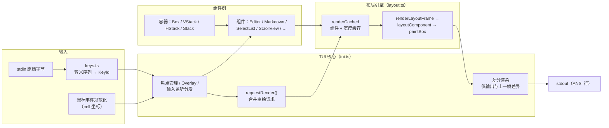
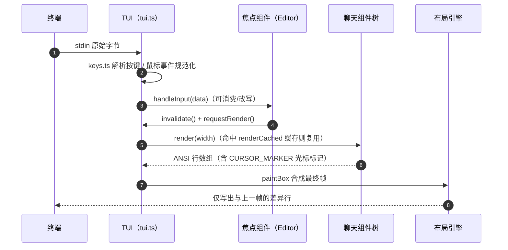

# 04 - pi-tui 包：终端 UI 库

> 返回 [Home](Home.md) | 包路径：`packages/tui`

## 1. 职责定位

`@earendil-works/pi-tui` 是独立的终端 UI 库，提供组件化、差分渲染（differential rendering）的 TUI 能力：组件树、布局系统、文本编辑器、鼠标支持、主题、图片显示等。pi-coding-agent 的交互模式完全构建在其上。测试使用 `node --test`（非 vitest）。

## 2. 目录结构

```
packages/tui/src/
├── tui.ts                 # 核心抽象：Component、TUI、ViewportTUI、鼠标事件
├── tui-main-screen.ts     # 主屏（inline 流式）TUI 实现
├── tui-alt-screen.ts      # 备用屏（全屏）TUI 实现
├── alt-screen-search.ts   # 全屏内搜索
├── layout.ts              # 布局引擎：测量、缓存、renderLayoutFrame/paintBox
├── layout-node.ts         # 布局节点
├── terminal.ts            # 终端底层封装（raw mode、尺寸、查询）
├── terminal-colors.ts     # OSC 11 背景色/配色方案探测
├── terminal-image.ts      # Kitty 图像协议支持
├── keys.ts                # 按键解析（Kitty keyboard protocol、matchesKey）
├── keybindings.ts         # 键绑定系统
├── editor-component.ts    # 编辑器组件
├── autocomplete.ts        # 自动补全
├── fuzzy.ts               # 模糊匹配
├── kill-ring.ts / undo-stack.ts / word-navigation.ts   # 编辑器周边能力
├── stdin-buffer.ts        # stdin 缓冲
├── native-module-path.ts / native-modifiers.ts         # 原生模块（macOS/Win 剪贴板等）
├── components/            # 组件库
│   ├── box.ts / text.ts / spacer.ts / stack.ts
│   ├── v-stack.ts / h-stack.ts          # 垂直/水平布局
│   ├── editor.ts / input.ts             # 编辑器/单行输入
│   ├── markdown.ts                      # Markdown 渲染（marked）
│   ├── select-list.ts / settings-list.ts # 选择列表
│   ├── scroll-view.ts                   # 滚动容器
│   ├── loader.ts / cancellable-loader.ts # 加载指示
│   ├── image.ts / truncated-text.ts / mouse-region.ts / alt-screen-flash.ts
└── utils.ts               # 宽度计算（东亚字符）、segment 处理
```

## 3. 核心抽象

### 3.1 `Component` 接口（`tui.ts`）

```ts
interface Component {
  render(width: number): string[];   // 按视口宽度渲染为行数组
  handleInput?(data: string): void;  // 键盘输入（获得焦点时）
  handleMouse?(event: TuiMouseEvent): TuiMouseEventResult | undefined;
  wantsKeyRelease?: boolean;         // 是否接收按键释放事件
  invalidate(): void;                // 使缓存失效（主题切换等）
}
```

所有 UI 元素都实现此接口。渲染输出为字符串行数组（含 ANSI 转义序列），宽度感知（`visibleWidth` 处理东亚宽字符）。

### 3.2 `TUI` / `ViewportTUI`（`tui.ts`）

主接口，管理：

- **差分渲染**：`requestRender()` 合并重绘请求，`renderNow()` 立即渲染；渲染时仅输出与上一帧的差异；
- **焦点管理**：`setFocus(component)`，`Focusable` 组件通过 `CURSOR_MARKER`（APC 序列）声明硬件光标位置（支持 IME 候选窗定位）；
- **Overlay**：`setOverlay(component, options)` 按 `OverlayAnchor`（center/top-left/…）悬浮显示；
- **输入监听**：`addInputListener`（可消费/改写原始输入）、鼠标事件分发（`dispatchMouseEvent`、捕获/焦点语义）；
- **终端能力**：背景色探测（OSC 11）、图像支持（Kitty 协议）、cell 尺寸。

两个实现：`TUI`（main screen，内联在终端滚动流中渲染，适合聊天式界面）与 `ViewportTUI`/alt-screen（全屏模式）。

### 3.3 布局系统（`layout.ts`）

- `renderCached(component, width)`：按组件 + 宽度缓存渲染结果；
- `measureHeight/measureWidth`：布局阶段快速估算尺寸；
- `renderLayoutFrame` → `layoutComponent` 生成 root box → `paintBox` 输出最终屏幕行。

容器组件（`Box`、`VStack`、`HStack`、`Stack`）负责子组件排列、padding、背景与鼠标事件转发。

### 3.4 渲染管线与输入循环（Mermaid）



单次输入到渲染的时序：



## 4. 主要组件一览

| 组件 | 说明 |
|------|------|
| `Box` | 通用容器（padding、背景、子组件） |
| `VStack` / `HStack` / `Stack` | 垂直 / 水平 / 弹性堆叠布局 |
| `Text` / `TruncatedText` | 静态文本 / 截断文本 |
| `EditorComponent` | 多行文本编辑器（undo、kill-ring、词导航、IME） |
| `Input` | 单行输入 |
| `MarkdownComponent` | Markdown → 终端样式渲染 |
| `SelectList` / `SettingsList` | 可搜索选择列表 / 设置项列表 |
| `ScrollView` | 滚动容器（鼠标滚轮、键盘滚动） |
| `Loader` / `CancellableLoader` | 加载动画 / 可取消加载 |
| `Image` | Kitty 协议终端图片 |

## 5. 输入处理

- `keys.ts`：解析原始转义序列为 `KeyId`；`matchesKey(data, "ctrl+x")` 风格的匹配；支持 Kitty keyboard protocol（按键释放、修饰符）。
- `keybindings.ts`：可配置键绑定（pi-coding-agent 的 `DEFAULT_EDITOR_KEYBINDINGS` / `DEFAULT_APP_KEYBINDINGS` 定义在此层之上）。
- 鼠标：规范化为 cell 坐标事件（`press/release/move/drag/click/wheel`），容器可实现 `capture`（持续路由）与 `focus`（请求键盘焦点）。

## 6. 依赖

- **外部**：`marked`（Markdown 解析）、`get-east-asian-width`（宽字符）
- **内部**：无（完全独立）
- **原生模块**（可选）：`native/darwin`、`native/win32` 提供 macOS/Windows 平台能力（剪贴板等），预编译 `.node` 文件随包分发

## 7. 在 pi-coding-agent 中的使用

交互模式（`packages/coding-agent/src/modes/interactive/`）以 `TUI` 为核心组装：`chat-viewport.ts`（聊天滚动视口）、`components/` 下 40+ 业务组件（assistant-message、tool-execution、diff、footer、model-selector 等）、`theme/`（JSON 主题系统）。测试可用 tmux 驱动（见 AGENTS.md 的 tmux 指南）。
