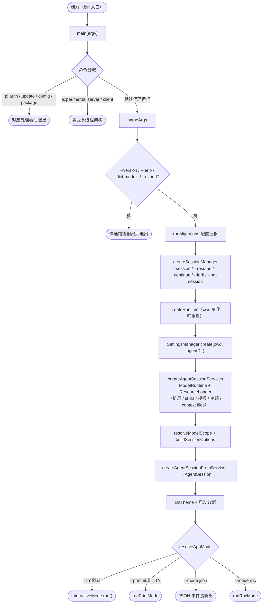
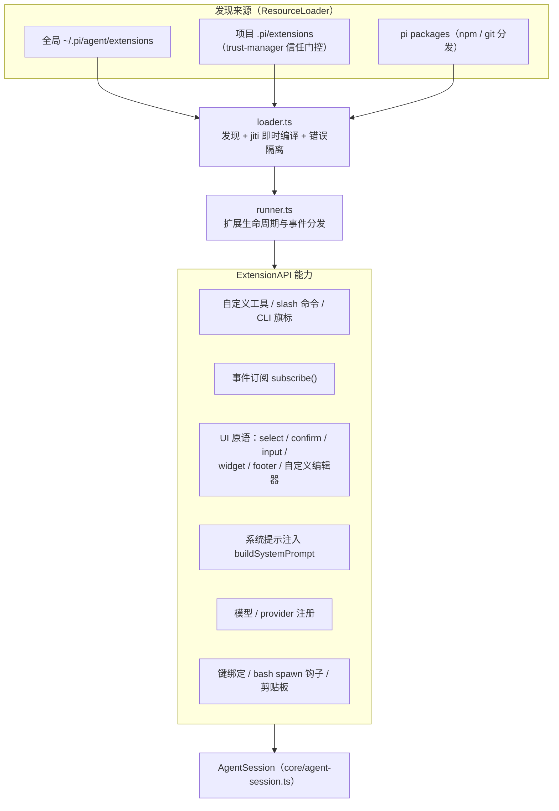

# 05 - pi-coding-agent 包：编码代理 CLI

> 返回 [Home](Home.md) | 包路径：`packages/coding-agent`

## 1. 职责定位

`@earendil-works/pi-coding-agent` 是发布到 npm 的最终产品：交互式编码代理 CLI（`pi` 命令）。它将 pi-ai（模型调用）、pi-agent-core（Agent/Harness）、pi-tui（终端 UI）组装为完整应用，并提供：

- 四种运行模式：interactive（TUI）/ print / json / rpc
- 内置编码工具（read、bash、edit、write、grep、find、ls、powershell）
- 扩展系统（TypeScript 扩展模块：自定义工具、命令、UI、事件订阅）
- 资源体系：settings、skills、prompt templates、themes、context files（AGENTS.md 等）
- 会话管理（JSONL 持久化、分支、fork、压缩、导出 HTML/JSONL）
- SDK（`createAgentSession`）供程序化嵌入

## 2. 目录结构

```
packages/coding-agent/src/
├── cli.ts                  # 进程入口（bin）：设置环境 → main(argv)
├── main.ts                 # 参数解析 → 运行模式分发
├── config.ts               # APP_NAME、路径（agentDir 等）、版本
├── index.ts                # SDK 公共导出
├── rpc-entry.ts            # RPC 模式独立入口（bundle 用）
├── migrations.ts           # 配置/会话迁移
├── package-manager-cli.ts  # pi update / pi config / pi package 命令
├── bun/                    # Bun 独立二进制入口（cli.ts、runtime-setup）
├── cli/                    # 参数与启动 UI
│   ├── args.ts             # parseArgs（全部 CLI 旗标）
│   ├── auth-command.ts / auth-check.ts / credential-print.ts
│   ├── session-picker.ts / startup-ui.ts / first-time-setup
│   ├── project-trust.ts / list-models.ts / initial-message.ts / file-processor.ts
│   └── experimental/       # 实验性 server/client 子命令
├── core/                   # 核心业务（与 UI 无关，三模式共用）
│   ├── agent-session.ts    # AgentSession（应用层会话门面）
│   ├── agent-session-services.ts  # 运行时服务组装（ModelRuntime/Settings/ResourceLoader）
│   ├── agent-session-runtime.ts   # 会话运行时（cwd 变更时重建）
│   ├── sdk.ts              # createAgentSession SDK 入口
│   ├── model-runtime.ts    # ModelRuntime：Models 运行时（凭据、自定义 provider、刷新）
│   ├── model-registry.ts / model-resolver.ts / models-store.ts / model-config.ts
│   ├── settings-manager.ts # SettingsManager（全局/项目设置合并）
│   ├── resource-loader.ts  # ResourceLoader（扩展/skills/模板/主题/context files 发现与加载）
│   ├── extensions/         # 扩展系统（loader/runner/types/wrapper）
│   ├── tools/              # 内置工具 + 渲染器（renderers/ 供 TUI 与 HTML 导出）
│   ├── compaction/         # 压缩与分支摘要（对接 agent-core）
│   ├── session-manager.ts  # SessionManager（JSONL 会话文件管理）
│   ├── session-cwd.ts / session-export.ts / event-bus.ts / exec.ts / bash-executor.ts
│   ├── system-prompt.ts    # 系统提示组装
│   ├── skills.ts / prompt-templates.ts / slash-commands.ts
│   ├── keybindings.ts / messages.ts（自定义 AgentMessage 类型）
│   ├── trust-manager.ts / project-trust.ts   # 项目信任
│   ├── auth-storage.ts / runtime-credentials.ts / provider-composer.ts / provider-attribution.ts
│   ├── http-dispatcher.ts  # undici dispatcher（代理、超时）
│   ├── package-manager.ts  # pi package 安装管理
│   ├── export-html/        # 会话 → HTML 导出（模板 + vendor 脚本）
│   ├── telemetry.ts / diagnostics.ts / usage-totals.ts / cache-stats.ts
│   ├── radius.ts           # Radius 中继（实验）
│   └── experimental.ts     # 实验特性开关
├── modes/                  # 运行模式
│   ├── interactive/        # TUI 交互模式
│   │   ├── interactive-mode.ts   # InteractiveMode 主控制器
│   │   ├── chat-viewport.ts / tui-renderer.ts
│   │   ├── components/     # 40+ TUI 组件（assistant-message、tool-execution、diff、footer…）
│   │   ├── theme/          # 主题系统（JSON 主题、theme-controller）
│   │   └── external-editor.ts / session-share.ts / model-search.ts …
│   ├── print-mode.ts       # 一次性执行输出
│   ├── json-event.ts       # JSON 事件流输出
│   ├── rpc/                # RPC 服务端模式（rpc-mode、rpc-client、jsonl、rpc-types）
│   └── index.ts
├── extensions/             # 内置扩展（llama.cpp 本地模型支持）
├── experimental/           # 实验性多进程架构
│   ├── server.ts / client.ts / client-tui.ts / coordinator.ts
│   ├── services/           # chord services（sessions、models、transcript、plugins…）
│   ├── session-worker.ts / session-worker-manager.ts
│   ├── mini/               # 最小化原型（server/worker/tui/shared）
│   └── plugins/            # 实验插件系统
├── client/                 # ./client 导出（RPC 客户端封装）
└── utils/                  # 通用工具（git、clipboard、image-resize、syntax-highlight、paths…）
```

## 3. 启动流程（`main.ts`）

`cli.ts`（bin 入口）→ `main(argv)`：

1. **命令分流**：`pi auth …`（认证命令）、实验性 `server`/`client` 子命令、`pi update/config/package`（包管理命令）各自处理后返回；
2. **参数解析** `parseArgs`；`--version`/`--export`/`--help`/`--list-models` 快速路径；
3. **运行模式判定** `resolveAppMode`：`rpc`/`json` 显式指定；`--print` 或非 TTY → `print`；否则 `interactive`；
4. **迁移** `runMigrations`（旧配置迁移、弃用警告）；
5. **会话定位** `createSessionManager`：处理 `--session`/`--resume`/`--continue`/`--fork`/`--session-id`/`--no-session`（内存会话），跨项目会话提示 fork；
6. **运行时组装**（`createRuntime` 工厂，cwd 变更时可重建）：
   - `SettingsManager.create(cwd, agentDir)`（项目信任状态影响可见资源）
   - `createAgentSessionServices`：`ModelRuntime` + `ResourceLoader`（加载扩展/skills/模板/主题，处理项目信任提示）；
   - `resolveModelScope` + `buildSessionOptions`：解析 `--model`/`--provider`/`--thinking`/`--models`、scoped models（Ctrl+P 切换）；
   - `createAgentSessionFromServices` → `AgentSession`；
7. **主题初始化** `initTheme`；诊断报告（扩展加载失败、设置问题）；
8. **模式分发**：`runRpcMode(runtime)` / `new InteractiveMode(runtime).run()` / `runPrintMode(runtime, …)`。

### 3.1 启动流程图



## 4. 核心模块说明

### 4.1 AgentSession（`core/agent-session.ts`）

应用层会话门面，包装 pi-agent-core 的 Agent，向三种模式与扩展系统暴露统一 API：`prompt()`、`setModel()`、`setThinkingLevel()`、`getActiveToolNames()`、压缩触发、事件总线订阅等。持有 `ExtensionRunner`、`SessionManager`、`ModelRuntime`、`SettingsManager`、`ResourceLoader`。

### 4.2 AgentSessionServices（`core/agent-session-services.ts`）

服务组装点：`createAgentSessionServices()` 创建 `ModelRuntime`（含自定义 provider 注册、凭据同步）、`SettingsManager`、`ResourceLoader` 并加载扩展 —— 是交互/打印/RPC 三模式共用的核心服务层。

### 4.3 ModelRuntime（`core/model-runtime.ts`）

`Models` 的运行时封装：管理凭据（`auth.json`）、本地 `models.json` 叠加、远程模型目录刷新、运行时 API key 覆盖（`--api-key`）、自定义 provider（扩展注册）。

### 4.4 SettingsManager（`core/settings-manager.ts`）

分层设置：全局（`~/.pi/agent/settings.json`）与项目（`.pi/settings.json`）合并，含默认模型、主题、defaultTools、httpProxy、terminal capability overrides 等；支持 override 叠加与诊断收集（`settings-diagnostics.ts`）。

### 4.5 ResourceLoader（`core/resource-loader.ts`）

发现并加载项目与全局资源：扩展（`.pi/extensions` 或 settings 路径）、skills（SKILL.md）、prompt templates、主题、context files（`AGENTS.md` 等）、shell aliases。项目信任（`trust-manager.ts`）决定是否加载项目级扩展。

### 4.6 SessionManager（`core/session-manager.ts`）

会话文件生命周期：`create/open/continueRecent/forkFrom/list/listAll/inMemory`；会话为 JSONL 文件（含 `session-info`、条目、压缩/分支摘要条目）；`buildSessionContext()` 恢复历史消息。

### 4.7 系统提示（`core/system-prompt.ts`）

组装系统提示：基础编码代理提示 + 环境（cwd、平台、日期）+ context files + skills 列表 + 扩展注入段落 + 自定义命令。

## 5. 内置工具（`core/tools/`）

| 工具 | 文件 | 说明 |
|------|------|------|
| `read` | `read.ts` | 读文件（行号标注、图片读取、截断策略 `truncate.ts`） |
| `bash` | `bash.ts` | Shell 执行（后台任务、输出捕获 `output-accumulator.ts`、超时/截断、spawn 钩子） |
| `powershell` | `powershell.ts` | Windows PowerShell 变体 |
| `edit` | `edit.ts` + `edit-diff.ts` | 精确字符串替换编辑（diff 生成） |
| `write` | `write.ts` | 写文件 |
| `grep` / `find` / `ls` | `grep.ts` / `find.ts` / `ls.ts` | 搜索/查找/列目录（只读组） |

每个工具提供 `create<Tool>Tool`（AgentTool 实例）与 `create<Tool>ToolDefinition`（含渲染器的 ToolDefinition）；`withFileMutationQueue` 串行化文件写操作。`renderers/` 提供 TUI 渲染（`tool-execution` 组件消费）。分组：coding 工具（read/bash/edit/write）、只读工具（read/grep/find/ls）、全部工具（allToolNames）。

## 6. 扩展系统（`core/extensions/`）

扩展是 TypeScript 模块（jiti 即时编译加载），能力包括（`types.ts`）：

- **事件订阅**：`context.subscribe(event, handler)` —— 消息、工具执行、会话事件等
- **注册 LLM 工具**（ToolDefinition，含 schema、execute、TUI 渲染器）
- **注册 slash 命令、CLI 旗标、自动补全 provider**
- **UI 原语**（`ExtensionUIContext`）：select/confirm/input 对话框、notify、状态栏、widget（编辑器上下方）、自定义 footer/header、自定义编辑器
- **系统提示注入**（`buildSystemPrompt`）、模型/provider 注册、键绑定、bash spawn 钩子、剪贴板等

`loader.ts` 负责发现与加载（含信任门控与错误隔离），`runner.ts` 管理扩展生命周期与事件分发，`wrapper.ts` 提供 `InlineExtension` 内联包装。内置扩展示例：`extensions/llama/`（llama.cpp 本地模型支持）。

### 6.1 扩展系统架构图



## 7. 运行模式

### 7.1 Interactive（`modes/interactive/`）

`InteractiveMode` 为总控制器：初始化 TUI、chat viewport、footer、编辑器、命令面板（`/`-命令、`@`-文件、`!`-bash 直通）；订阅 AgentSession 事件驱动渲染；处理模型/主题/会话选择器、Ctrl+P 模型切换、`plan mode`（扩展实现）等。组件目录含 assistant-message（流式 Markdown + thinking 折叠）、tool-execution（工具调用渲染）、diff（编辑 diff）、mermaid 等组件。

### 7.2 Print / JSON（`modes/print-mode.ts`、`modes/json-event.ts`）

一次性执行：读取初始消息（参数、`@file`、stdin 管道）→ `session.prompt()` → 输出最终文本（print）或逐事件 JSON 行（json）。`output-guard.ts` 保证 stdout 纯净（扩展误写保护）。

### 7.3 RPC（`modes/rpc/`）

stdin/stdout 上的 JSON-RPC 服务端（IDE/SDK 集成）：`rpc-mode.ts` 主循环、`rpc-types.ts` 协议类型、`jsonl.ts` JSONL 编解码、`rpc-client.ts` 进程内客户端封装。SDK 用法见 `docs/sdk.md` 与 `docs/rpc.md`。

### 7.4 实验性多进程架构（`experimental/`）

基于 chord + pi-protocol 的下一代架构（详见 [07-RPC 协议栈](07-rpc-stack.md)）：`pi experimental server` 启动持有 Session/worker 的服务进程；`pi experimental client` 以 TUI 或 CLI 连接；`services/` 内是 chord service 定义（sessions、models、transcript、slash-commands、agent-controller、plugins）；`session-worker.ts`/`session-worker-manager.ts` 管理 worker 进程；`radius-relay.ts` 提供远程中继。

## 8. SDK（`core/sdk.ts` + `index.ts`）

```ts
import { createAgentSession } from "@earendil-works/pi-coding-agent";

const { session } = await createAgentSession({
  cwd, agentDir, model, thinkingLevel, tools, excludeTools,
  noTools, customTools, resourceLoader, sessionManager, settingsManager,
});
await session.prompt("Hello");
```

同时导出工具工厂（`createCodingTools` 等）、`withFileMutationQueue`、扩展类型（`ExtensionAPI` 等）、`PromptTemplate`、`Skill` 等，支持完整程序化嵌入。

## 9. 依赖

- **内部**：`pi-agent-core`、`pi-ai`、`pi-tui`、`pi-client`、`pi-protocol`、`chord`
- **外部**：`chalk`、`cross-spawn`、`diff`、`grok-mermaid`、`highlight.js`、`hosted-git-info`、`ignore`、`jiti`、`minimatch`、`proper-lockfile`、`semver`、`typebox`、`undici`、`yaml`、`@silvia-odwyer/photon-node`（图片处理 WASM）、可选 `@mariozechner/clipboard`

## 10. 构建产物

- `dist/bundle/cli.js`：esbuild 打包的 CLI（`pi` bin）
- `dist/bundle/rpc-entry.js`：RPC 入口
- `dist/index.js`：SDK（unbundled）
- `src/bun/cli.ts` + `bun build --compile`：Bun 独立二进制（`build:binary`）
- 发布包含 `npm-shrinkwrap.json`（锁定传递依赖，见 [10-构建与运行](10-build-and-run.md)）
