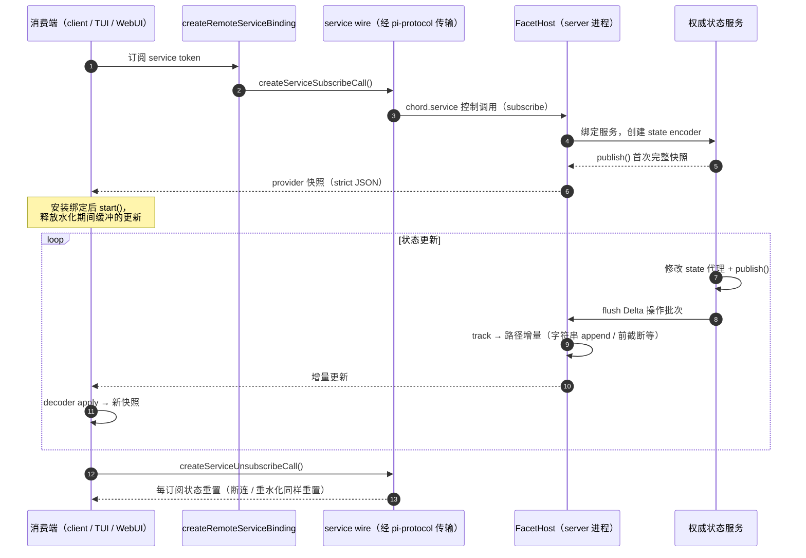
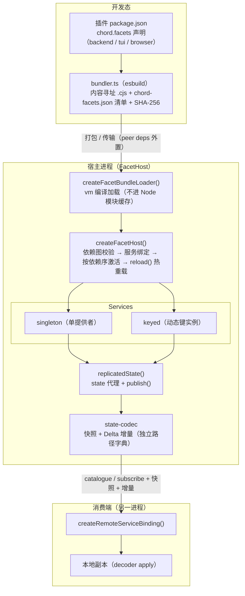

# 06 - chord 包：应用组合运行时

> 返回 [Home](Home.md) | 包路径：`packages/chord`

## 1. 职责定位

`@earendil-works/chord` 是**独立于 Pi** 的应用组合运行时（不依赖任何其他 workspace 包），用于构建"由插件/扩展组装而成、且需要跨进程/跨环境运行"的应用。动机：一个功能可能需要同时运行在 agent worker、终端 UI、远程 WebUI 等多个环境中，chord 提供统一的机制来声明、拆分、绑定与分发这些能力。

核心概念：

| 概念 | 说明 |
|------|------|
| **Plugin** | 同步 setup 单元，声明提供与依赖的 services；host 校验完整依赖图、绑定服务、按依赖序激活、逆序销毁 |
| **Facet** | 插件的一部分，按目标环境（backend/TUI/browser）分别打包与加载 |
| **Service** | 类型稳定的 token：singleton（单提供者）或 keyed（动态键实例）；可进程本地或远程暴露 |
| **Replicated state** | 权威状态发布：生产者改 `state` 代理并 `publish()`，消费者收到完整不可变值 |
| **Delta tracking** | 从被追踪的 plain JSON 派生紧凑操作（字符串 append/前截断、数组 append），无变更历史保留 |
| **Remote service boundary** | 传输无关的服务 wire 语法（catalogue/subscribe/unsubscribe、快照与增量更新） |
| **Context** | Go 风格 context：取消传播与调用级应用值 |

命名约定：chord 自有标识使用 `chord.*` 命名空间，保留 service 前缀 `$chord.*`。

## 2. 目录结构

```
packages/chord/src/
├── api.ts          # 对外 API：createFacetHost、defineService、defineFacet、
│                   #   createRemoteServiceBinding、replicatedState、combineFacetLoaders…
├── index.ts        # 根导出
├── node.ts         # Node 专用：createFacetBundleLoader（vm 编译加载）
├── bundler.ts      # esbuild 打包 facet（bundleFacetPackage / bundleFacets）
├── json.ts         # JsonRepresentation<T>、isJsonValue（strict-JSON 边界）
├── types.ts        # 核心类型
├── services/       # service wire：wire.ts（控制调用构造/解析）、state-codec.ts（快照/增量编解码）
├── delta/          # 独立 delta 原语：track/apply（见 src/delta/README.md）
└── context/        # context 子路径（@earendil-works/chord/context）
```

## 3. 核心 API（`api.ts`）

- `defineService<T>()`：创建类型化 service token
- `createFacetHost()`：facet 宿主 —— 注册插件、校验依赖图、绑定与激活、`reload()` 热重载
- `defineFacet(loader)`：声明 facet 加载器
- `combineFacetLoaders(...)`：合并多个加载器
- `createRemoteServiceBinding()`：远程服务绑定（消费端）
- `replicatedState(initial)`：创建被追踪的复制状态（`state` 代理 + `publish()`）
- Context 常量与函数在 `@earendil-works/chord/context` 子路径（`BACKGROUND_CONTEXT` 等，agent-core 的 harness context 基于它）

## 4. 服务 wire 语法（`services/`）

- `wire.ts`：`createServiceCatalogueCall()` / `createServiceSubscribeCall()` / `createServiceUnsubscribeCall()` 构造 `$chord.service` 控制调用；`parseServiceCall()` / `parseServiceCatalogue()` 校验
- `state-codec.ts`：每个订阅一个 `createServiceStateEncoder()`（提供端）/ `createServiceStateDecoder()`（消费端），维护独立 Delta 路径字典，替换/断连/重水化时重置

要求：跨边界的参数、结果、快照、更新、目录必须是 strict JSON（`JsonRepresentation<T>` 派生 wire 安全类型，`isJsonValue()` 在适配器边界校验）；chord 不规定 framing、路由、传输或外层信封（那由 pi-protocol 提供）。

### 4.1 远程服务订阅时序图



## 5. Delta 追踪（`delta/`）

```ts
import { apply, track } from "@earendil-works/chord/delta";

const changes = track({ output: "", count: 0 });
changes.flush();               // 首次 flush 为完整 base batch
changes.state.output += "done\n";
const ops = changes.flush();   // 之后为基于路径的增量操作
const replica = apply({}, ops);
```

`replicatedState()` 直接建立在其上：`publish()` flush 一次，远端连接为每个 client/state 配对独立编码该操作批次。字符串赋值保留纯 append 与滚动窗口移动（append + front-truncate），无关重写回退为 set。

## 6. Facet 打包与加载

- **打包**（`bundler.ts` + `@earendil-works/chord/bundler`）：读取插件 `package.json` 的 `chord.facets` 配置（可覆盖/禁用默认 facet 路径），用 esbuild 编译为**内容寻址的 CommonJS 文件**（每入口一个 `.cjs` + `chord-facets.json` 清单）；peer dependencies 外置，由宿主解析。chord 绝不安装依赖或运行包生命周期脚本。
- **加载**（`node.ts` + `@earendil-works/chord/node`）：`createFacetBundleLoader()` 校验 SHA-256 完整性后用 `node:vm` 直接编译 CommonJS 体（不进入 Node 模块缓存）；`load()` → `FacetHost.reload()` 热重载：候选验证通过后逐个替换单例，旧代 dispose，服务句柄不断连。
- **传输**：`readFacetBundleArtifact()` 打包单个验证过的清单条目及其源；`createFacetBundleArtifactLoader()` 在接收端物化临时代。

### 6.1 Facet 打包、加载与服务组合图



## 7. 在 Pi 中的使用

- **pi-agent-core**：`harness/context.ts` 基于 chord Context；`LaneTranscriptSnapshot`/`LaneWatchEvent` 使用 `JsonRepresentation` 保证可发布到远端。
- **pi-coding-agent 实验架构**：`experimental/services/` 用 chord services 定义 sessions、models、transcript、slash-commands、agent-controller 等服务；server 进程通过 `pi-server` 暴露，client（TUI/WebUI）订阅复制状态。
- **pi-server / pi-client**：在协议边界使用 chord 的 service 控制解析与每订阅状态解码器。

## 8. 依赖

- **外部**：esbuild（bundler 子路径）、typebox（schema 校验）
- **内部**：无 —— chord 是零内部依赖的独立包
