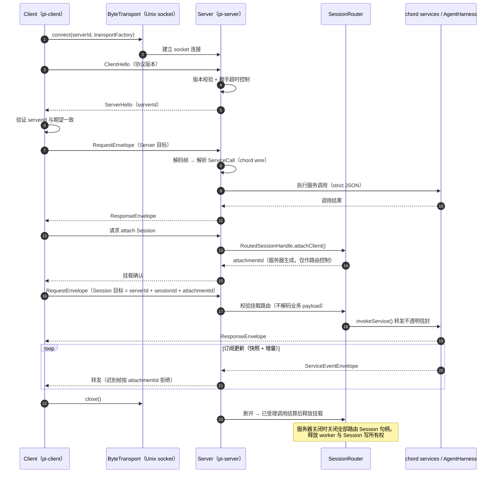

# 07 - RPC 协议栈：pi-protocol / pi-client / pi-server

> 返回 [Home](Home.md) | 包路径：`packages/protocol`、`packages/client`、`packages/server`

## 1. 总览

三个包共同构成 Pi 的实验性本地 RPC 协议栈（protocol version 8），支撑"一个持久化 Session、多个呈现端（TUI/WebUI/CLI）"的多进程架构：

```
┌──────────────┐   Unix socket / 任意有序字节传输   ┌──────────────────┐
│  pi-client   │ ◄──────────────────────────────► │  pi-server        │
│  Client      │    4 字节长度前缀 + CBOR 帧        │  Server/Listener  │
│  Connection  │                                  │  SessionRouter    │
└──────┬───────┘                                  └────────┬─────────┘
       │ createClientServiceTransport()                    │ RoutedServerServiceHost
       ▼                                                  ▼
  chord 服务绑定（类型化 RPC/订阅）              chord services（sessions/models/transcript…）
                                                          │
                                                          ▼
                                              AgentHarness + Session（进程本地）
```

职责边界：

- **pi-protocol**：信封格式、CBOR 编码、字节流分帧（运行时中立）
- **pi-client**：传输无关客户端（握手、请求关联、服务订阅）
- **pi-server**：连接/握手/路由服务器（Session 目标路由、多呈现端挂载）
- **chord**：承载信封内的服务语义（调用语法、目录、快照/增量、错误码）

### 1.1 架构图（Mermaid）

```mermaid
graph LR
    subgraph ClientProcess["客户端进程"]
        CUI["TUI / WebUI / CLI 呈现端"]
        CLIENT["pi-client<br/>Client / Connection"]
        TRANSPORT["createClientServiceTransport()<br/>chord 服务绑定"]
    end
    subgraph Wire["传输（任意有序字节流）"]
        SOCK["Unix domain socket<br/>4 字节大端长度前缀 + CBOR 帧（≤16 MiB）"]
    end
    subgraph ServerProcess["服务进程"]
        SERVER["pi-server<br/>Server / ServerListener"]
        ROUTER["SessionRouter<br/>RoutedServerServiceHost /<br/>RoutedSessionHandle"]
        SVC["chord services<br/>sessions / models / transcript / …"]
        WORKER["AgentHarness + Session<br/>（进程本地 / session worker）"]
    end

    CUI --> CLIENT
    CLIENT <--> TRANSPORT
    TRANSPORT <--> SOCK
    SOCK <--> SERVER
    SERVER <--> ROUTER
    ROUTER <--> SVC
    SVC <--> WORKER
```



## 2. pi-protocol（`packages/protocol`）

### 2.1 消息格式（`src/protocol.ts`）

客户端消息：`ClientHello`（版本握手）、`RequestEnvelope`（请求）、`CancelEnvelope`（取消）。
服务器消息：`ServerHello`（含逻辑 `serverId`）、`ResponseEnvelope`、`ServiceEventEnvelope`（订阅更新）、`AttachmentEnvelope`（带外挂载变更）。

路由目标两级：

- Server 目标：`{ serverId }`
- Session 目标：`{ serverId, sessionId, attachmentId }` —— 综合路由将调用栅栏到一个逻辑 server、一个持久 Session、一个活跃呈现端挂载；服务器生成的 `attachmentId` 拒绝切换/重挂后的迟到帧。

### 2.2 编码与分帧（`src/codec.ts`、`src/framing.ts`、`src/cbor/`）

- 每帧 = 4 字节大端 payload 长度 + 一个定长 CBOR item；
- `encodeClientMessage()` / `encodeServerMessage()`：TypeBox schema 校验 → CBOR 编码 → 分帧；
- `ClientMessageDecoder` / `ServerMessageDecoder`：接受任意流分段与合并；
- CBOR 实现（`cbor/encoder.ts`、`cbor/decoder.ts`）为严格子集：null/bool/number/string/Uint8Array/array/object，限制深度（64）、容器长度（1e6）、循环检测；非有限数、`undefined`、原型、循环均拒绝。

默认限制：每帧 16 MiB。所有信封 schema 拒绝未知属性；违规抛 `ProtocolValidationError`。opaque payload 只校验 strict JSON，语义由 chord 适配器边界校验。

## 3. pi-client（`packages/client`）

### 3.1 核心类

- **`Client`**（`client.ts`）：主入口。`Client.connect({ serverId, transportFactory })` 打开传输、发送 hello、验证服务器报告的 `serverId`；`request(target, call)` 发起关联请求；`subscribeService()` 订阅服务（快照 + 增量）；`reconnect()` 显式重连（不自动重连、不重放请求）；断开时本地拒绝 pending 请求并清除挂载路由。
- **`Connection`**（`connection.ts`）：连接生命周期（连接状态机、握手、超时）。
- **`transport.ts` / `unix.ts`**：`ByteTransportFactory` 抽象（`send/close` + `onData/onClose/onError` 回调）；Unix domain socket 工厂 `createUnixTransportFactory({ path })` 与发现 `discoverUnixServers({ directory })`（最多并发探测 16 个 socket，校验文件名推导的 serverId）。
- **`promise.ts`**：请求/响应关联的 promise 管理。

### 3.2 与 chord 的衔接

`createClientServiceTransport()` 把（惰性解析的）server 或 Session 路由适配为 chord 传输；客户端使用 chord 的 service 控制解析器与每订阅状态解码器。订阅返回完整 provider 快照，绑定安装后调用 `start()` 释放水化期间缓冲的更新。

## 4. pi-server（`packages/server`）

### 4.1 核心类

- **`Server`**（`server.ts`）：接受连接 → 创建解码器 → 握手（校验协议版本、attach 客户端服务、发送 ServerHello、握手超时）→ 处理请求（解析 `ServiceCall`，执行普通调用或 subscribe/unsubscribe，维护 active requests，发送 response/service_update）。
- **`ServerListener`**：传输组合抽象；Unix 预设 `createUnixListener()` / `createUnixServer()`（`server/unix` 子路径），`getUnixSocketPath(serverId, dir)` 从逻辑 ID 派生 socket 路径。
- **`SessionRouter`**（`session-router.ts`）：Session 目标路由 —— 校验挂载路由但**不解码业务 payload**；`RoutedServerServiceHost.attachClient()` 创建连接级服务器服务端点；`RoutedSessionHandle.attachClient()` 返回呈现端级 Session 能力，其 `invokeService()` 把不透明服务信封转发给所选 Session 端点。

### 4.2 生命周期语义

- Session 可有多个呈现端挂载；同一连接重复 attach 幂等；每次成功挂载获得服务器生成的 `attachmentId`（仅作路由控制数据）；
- 连接断开只在其已受理调用结算后释放挂载；服务器关闭关闭所有路由 Session 句柄（释放 worker 与 Session 写所有权）；
- Session 发现与管理是应用拥有的服务（`SessionDirectory`、`SessionManagement`）；服务器只向 resolver 询问元数据；
- 服务器/worker 生命周期在公共协议之外：可替换 server 进程拥有私有生命周期协议，实验性 coordinator 只做不透明消息路由。

### 4.3 连接与调用时序图



## 5. 在 pi-coding-agent 中的落地

- `pi experimental server`（`experimental/server.ts` + `services/`）：启动前台 server 进程，注册 chord services（sessions、models、transcript、slash-commands、plugins、agent-controller），通过 session-worker 管理每 Session 的 worker 进程；
- `pi experimental client`（`experimental/client.ts` / `client-tui.ts`）：连接 server，attach 到 Session，以 TUI 或流式文本呈现（`services/presentation-ui.ts`、`transcript.ts` 提供 UI 侧服务）；
- `radius-relay.ts`：基于 Radius 的远程中继（实验）。

协议栈整体标记 **experimental，无兼容性保证**。

## 6. 依赖关系

| 包 | 内部依赖 | 外部依赖 |
|----|---------|---------|
| pi-protocol | 无 | typebox |
| pi-client | pi-protocol、chord | 无 |
| pi-server | pi-protocol、chord、pi-agent-core（类型） | 无 |
